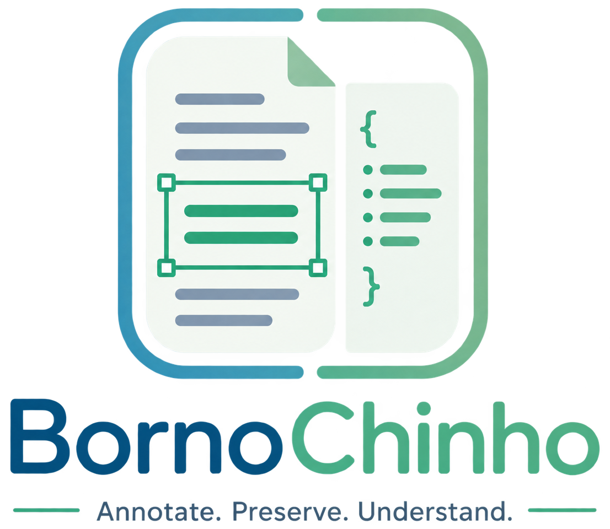

  
  
<em>Annotate. Preserve. Understand.</em>

# User Guide

How to use BornoChinho to review and correct document-layout annotations. For installation, see the [README](README.md).

## The workspace

Open `http://localhost:2828`. The window has four parts:

| Area | What it does |
| --- | --- |
| **Toolbar** (top left) | Load images, toggle the box overlay, clear boxes, switch theme, open About |
| **Image pane** (left) | Shows the page image; draw boxes here, zoom and page through images |
| **JSON pane** (right) | The annotation file as editable text, with find & replace and Save |
| **Status bar** (bottom) | Annotation count, image size, overlay state, and JSON validity |

Drag the divider between the two panes to resize them. Double-click it to return to the default 60/40 split. Your theme and split position are remembered between sessions.

## Two ways to load work

### Single files

- **Image** — loads one image into the left pane.
- **Load** (JSON pane) — loads one annotation file into the editor.

Use this for a quick look at one page.

### Mounted folders — recommended

- **Mount Images** — pick a folder of images.
- **Mount JSON** — pick a folder of `.json` annotation files.

BornoChinho pairs the two folders **by filename**, so `page_0003.png` pairs with `page_0003.json`. Pages sort naturally, meaning `page_2` comes before `page_10`. Once mounted, pagers appear under each pane so you can step through the whole set, and **Save writes back to the original file in place** — no downloads, no re-filing.

You can mount just one folder and browse it alone, and re-mount either side later to switch folders.

> **Browser requirement:** Mounting needs the File System Access API — use **Chrome or Edge**, and open the app on `localhost`. A LAN address like `http://192.168.x.x` is not a secure context and mounting will be refused. Firefox and Safari can still use the single-file buttons, where Save falls back to a download.

The first time you save into a mounted folder, the browser asks for write permission. Grant it, or the file will not be written.

## Reviewing annotations

Click **Show Boxes** to draw every box from the JSON editor onto the image. Each box is colored by category and labeled with its category and index:

| | | | | |
| --- | --- | --- | --- | --- |
| 🟩 Text | 🟩 List-item | 🟦 Page-header | 🟦 Page-footer | 🟪 Picture |
| 🟧 Table | 🟥 Title | 🟦 Section-header | 🟨 Caption | 🟪 Footnote |

The overlay is **read-only and live** — it redraws from whatever is in the editor right now, so fixing a coordinate in the text immediately moves the box on the image. Entries with a missing or unusable `bbox` are skipped, so a partly-annotated file draws only the boxes it has.

Use the zoom controls (or `Ctrl` `+` / `-`) to inspect tight regions, and the reset button to fit the page back to the pane height.

## Paging through a set

Each pane has its own pager, so you can hold an image still while scrolling through neighbouring annotation files. When the two panes drift apart, both pagers highlight and a **Sync** button appears — click it to snap the JSON pane back to the image's page.

## Editing the JSON

The editor is plain text, so you can fix anything by hand. The status bar tells you whether the JSON currently parses and how many entries it holds.

- **Find & replace** — `Ctrl`+`H` opens the bar; a counter shows how many matches were found. Use Replace for one match or Replace All for every match.
- **Right-to-left view** — the pilcrow button switches the editor to RTL, for annotating Arabic, Urdu, or other RTL scripts.
- **Zoom** — the floating controls in the editor scale the text independently of the image.

## Drawing new boxes

Drag on the image to draw a rectangle. Very small drags (under a few pixels) are ignored so a stray click does not create a box. The new rectangle is selected automatically and its coordinates appear in the **Selected Rectangle** panel.

- `Delete` or `Backspace` removes the selected rectangle.
- The **trash** button clears all drawn rectangles, after a confirmation.

> **Note:** Drawn rectangles live in the image pane and are all created with the category `text`. They are a measuring aid for reading off coordinates — they are not written into the JSON file by Save. To add an annotation to the file, read the coordinates from the Selected Rectangle panel and type the entry into the editor.

## Saving

**Save** validates before it writes. The file is only written if validation passes with zero errors.

If problems are found, a dialog lists each one with the offending entry. Validation checks:

- **Schema** — exactly the required keys for the category, no missing or extra ones (`Picture` needs `bbox` and `category`; everything else also needs `text`)
- **Category** — must be one of the ten known categories
- **Bounding box** — all coordinates positive, with `x1 < x2` and `y1 < y2`

Fix the entries the dialog names, then save again. On success the button briefly turns green and reads *Saved!*

Where the file goes depends on how it was loaded: a mounted file is **overwritten in place**; a single-file load is **downloaded** to your Downloads folder.

## Keyboard shortcuts

| Keys | Action |
| --- | --- |
| `Ctrl`+`H` | Open find & replace |
| `Ctrl`+`+` / `Ctrl`+`-` | Zoom the image in / out |
| `Ctrl`+`0` | Reset image zoom |
| `Delete` / `Backspace` | Delete the selected rectangle |
| `Escape` | Close the About dialog |
| `←` / `→` | Resize the panes (when the divider has focus) |
| `Home` | Reset the split (when the divider has focus) |

## Troubleshooting

| Problem | Cause and fix |
| --- | --- |
| *Mount buttons show an error* | Browser lacks the File System Access API. Use Chrome or Edge on `localhost`. |
| *"No matching pairs found"* | Image and JSON filenames must match apart from the extension, e.g. `page_0003.png` / `page_0003.json`. |
| *"That folder contains no images / .json files"* | Wrong folder picked, or the files use an extension outside `png, jpg, jpeg, webp, bmp, gif` / `json`. |
| *Save says permission was declined* | The browser's write prompt was dismissed. Save again and allow it. |
| *"Invalid JSON format"* | The editor text is not valid JSON — check the status bar and look for a stray comma or bracket. |
| *Boxes do not appear* | **Show Boxes** is off, or entries lack a valid `bbox`. The status bar reports how many boxes are drawn. |
| *Some images have no annotations* | Images without a matching `.json` are skipped from the pairing; the browser console lists them. |

## Getting help

Click the **info** button in the toolbar for a quick in-app reference, or open an issue on [GitHub](https://github.com/mhshesher/BornoChinho).
